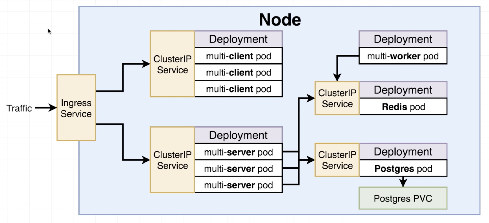

# Fibonacci - Kubernetes Style
This project is a fibonacci calculator that consists of a React frontend,
an express server, and a redis Cache and a Postgres database for storing
calculator requests.

## Client
The react frontend, packaged into a Docker container
```
docker build -t <docker_user>/multi-client
docker push <docker_user>/multi-client
```

## Server
Makes requests to redis cache and postgres db for answers to Fibonacci
sequence.
```
docker build -t <docker_user>/multi-server
docker push <docker_user>/multi-server
```

## Worker
Actually calculates the nth number in the sequence and stores the answer
in Redis cache
```
docker build -t <docker_user>/multi-worker
docker push <docker_user>/multi-worker
```

## Kubernetes
Each service/deployment has it's own file within the [k8s](./k8s) directory.
The architecture is described in the diagram below.


## Build and Deploy
Building and deploying the project is largely handled by [Gitlab CI](.gitlab-ci.yml)
but there are a few initial manual steps before CI-CD is handled automatically.

Manual steps include:
1. Creating the cluster (named fib-cluster in my case)
2. Creating a service-account with GKE permissions
3. Downloading a .json key for that service account
4. Encrypting via openssl - I use a passphrase encryption so the phrase
can be stored in Gitlab CI (Gitlab CI does not work well with files at 
the time of writing). ***Note: The openssl version used to encrypt must 
be the same as the one used in the google-cloud/sdk docker image (this 
is the image used in the k8s-deploy gitlab ci stage and where decryption 
takes place)
4b. Alternatively you could add a step in the gitlab-ci file to download
a specific version of openssl into the google-cloud/sdk docker img.
5. Replacing my key with your encrypted key to the repo. DO NOT ADD YOUR
 PLAIN TEXT KEY.
6. Changing/modifying the appropriate file names/gitlab variables to
suit your needs.
